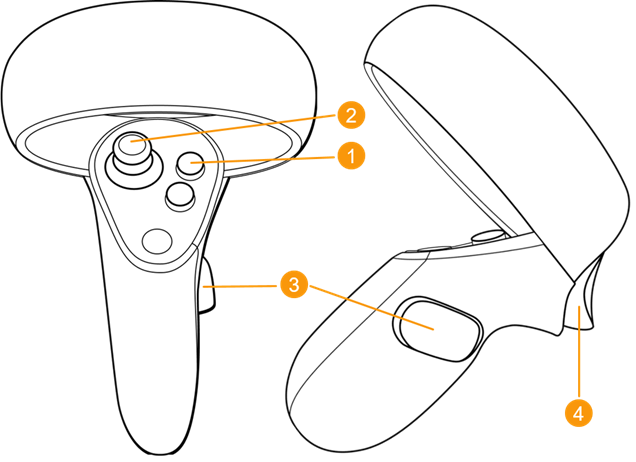

```python
import openmm as mm
from openmm import app as app
from openmm import unit as unit


import sys
from nanover.openmm.serializer import serialize_simulation
from nanover.omni import OmniRunner
from nanover.omni.openmm import OpenMMSimulation
from nanover.app import NanoverImdClient
from nanover.app import RenderingSelection
import matplotlib.cm
from nanover.mdanalysis import frame_data_to_mdanalysis
```

# Set up the simulations 💻

From this lines we will load the pdb file we want to simulate. We are loading to simulations

We are loading a Polyalanine simulation on the first simulation

The two proteins we have inside are **TAZ** and **TEAD proteins** in the second simulation

#### Polyalanine Simulation


```python
poly = app.PDBFile('openmm/openmm_files/17-ala.pdb')
forcefield = app.ForceField('amber99sb.xml', 'tip3p.xml')
system_poly = forcefield.createSystem(
    poly.topology,
    nonbondedMethod=app.PME,
    nonbondedCutoff=1 * unit.nanometer,
    constraints=app.HBonds,
    removeCMMotion=False,
) 

integrator_poly = mm.LangevinIntegrator(
    300 * unit.kelvin,
    1 / unit.picosecond,
    0.002 * unit.picoseconds,
)
simulation_poly = app.Simulation(poly.topology, system_poly, integrator_poly)
simulation_poly.context.setPositions(poly.positions)
```

#### YAP/TEAD Simulation


```python
pdb = app.PDBFile('openmm/openmm_files/output_filename.pdb')
forcefield = app.ForceField('amber99sb.xml', 'tip3p.xml')
system = forcefield.createSystem(
    pdb.topology,
    nonbondedMethod=app.PME,
    nonbondedCutoff=1 * unit.nanometer,
    constraints=app.HBonds,
    removeCMMotion=False,
) 

integrator = mm.LangevinIntegrator(
    300 * unit.kelvin,
    1 / unit.picosecond,
    0.002 * unit.picoseconds,
)
simulation = app.Simulation(pdb.topology, system, integrator)
simulation.context.setPositions(pdb.positions)
```

We will minimize the system to avoid artifacts and to avoid the simulation to break.


```python
simulation_poly.minimizeEnergy()
simulation_poly.step(100)
poly.topology
```


    <Topology; 1 chains, 17 residues, 173 atoms, 172 bonds>


```python
simulation.minimizeEnergy()
simulation.step(100)
pdb.topology
```


    <Topology; 2 chains, 272 residues, 4356 atoms, 4407 bonds>


By running this cell we will unite the simulation parameters inside the variable protein_simulation, and pass the simulation to the runner.  

The runner will run the simulation itself but also it will create a connection to the server in a free port (by setting ```port=0```). If not, it will be in the default port.

With ```imd_runner.next()``` we are running the simulation


```python
# Create the OpenMMSimulation instance
protein_simulation = OpenMMSimulation.from_simulation(simulation)
poly_simulation = OpenMMSimulation.from_simulation(simulation_poly)

# Pass the simulation to the runner
imd_runner = OmniRunner.with_basic_server(protein_simulation, poly_simulation, name="Demo_Server", port=0)

# Run the simulation
imd_runner.next()
```

Chek the port we are in, and check if it is connected.


```python
print(f'{imd_runner.app_server.name}: serving at {imd_runner.app_server.address}:{imd_runner.app_server.port}')
```

    Demo_Server: serving at [::]:50540
    

******************************

## Playground

From here we are ready to open the **Nanover App** on the headset.  

<div style="display: flex; align-items: center;">
    <div style="width: 50%;">
        <p>Once we are in, you need to interact with the controllers: 

- Select with the **Trigger (4)** on _Discover_.

- Select _Refresh_ to update the list of available servers.

- Select the server we want to use.
        </p>
    </div>
    <div style="width: 50%;">
        
        <p><strong>Source</strong>: <a href="https://help.autodesk.com/view/VREDPRODUCTS/2025/ENU/?guid=VRED_VR_and_VR_Setup_Using_the_Oculus_Rift_with_VRED" target="_blank">Controllers VRED 2025 AutoDesk</a></p>
    </div>
</div>


### Changing the visualization

First of all, we need to save our simulation in a file our app can read.  

We will save it inside the path you can see in red color, and it will be named as ```TEAD_complex.xml```. (Actually not needed)


```python
with open('openmm/openmm_files/TEAD_complex.xml', 'w') as outfile:
    outfile.write(serializer.serialize_simulation(simulation))
```

We are defining two auxiliar functions we are using.  

- The first one will allow us to use [**MDAnalysis**](https://www.mdanalysis.org/) syntax to make selections to visualize our simulation.


```python
# Modified function
def generate_mdanalysis_selection(selection: str, v: bool=False):
    # Crear el objeto Universe a partir del primer frame
    universe = frame_data_to_mdanalysis(client.first_frame)
    
    # Seleccionar los átomos según la selección
    selected_atoms = universe.select_atoms(selection)
    
    # Obtener los residuos únicos (para evitar duplicados) asociados a los átomos seleccionados
    selected_residues = selected_atoms.residues

    bonds = selected_atoms.bonds.atomgroup_intersection(selected_atoms, strict=True)
    
    # Si verbose es True, imprimir los nombres de los residuos
    if v:
        for residue in selected_residues:
            print(f"Residuo: {residue.resname}, Resid ID: {residue.resid}")
    
    # Retornar los índices de los átomos seleccionados
    idx_array = selected_atoms.indices
    
    # Retornar los índices como enteros
    return list(map(int, idx_array))
```

- The second one will be for setting a color map for some representation using [**Matplotlib**](https://matplotlib.org/).


```python
def get_matplotlib_gradient(name: str):
    cmap = matplotlib.colormaps[name]
    return list(list(cmap(x/7)) for x in range(0, 8, 1))
```

We need to create a client to be able to modify the representations inside the app.


```python
from nanover.app import NanoverImdClient

client = NanoverImdClient.connect_to_single_server(port=imd_runner.app_server.port)
client.subscribe_to_frames()
client.wait_until_first_frame();
# Begin tracking updates to the shared multiplayer values
client.subscribe_multiplayer()
```


```python
def hide_root():
    root_selection = client.root_selection
    with root_selection.modify():
        root_selection.hide =  True
        root_selection.interaction_method = 'single'
```

# Polyalanine Simulation

First we are going to play with a polyalanine peptide. Try to make a knot with it. I dare you!

<div style="display: flex; align-items: center;">
    <div style="width: 50%;">
        <p>In order to moving around the representation, you can use one or both controllers. Both recommended.

To interact with the simulation you can press and hold the **Trigger (4)** and pull the atom towards yourself. 

If you dont see any changes, you can move slowly the **Right Joystick (2)** to the right to increase the force.

Moreover, by pressing both **Grip Buttons (3)**, you can rotate, zoom in and zoom out, and translate the simulation box.</p>
    </div>
    <div style="width: 50%;">
        
        <p><strong>Source</strong>: <a href="https://help.autodesk.com/view/VREDPRODUCTS/2025/ENU/?guid=VRED_VR_and_VR_Setup_Using_the_Oculus_Rift_with_VRED" target="_blank">Controllers VRED 2025 AutoDesk</a></p>
    </div>
</div>


This will hide the "root_selection". 


```python
hide_root()
```

By default, we are seeing the proteins displayed as **"Ball and Stick"** representation. However, we can change this for a better visualization!

## Let's change the visualization now.


```python
poly_selection = client.create_selection("poly", [])
with poly_selection.modify():
    poly_selection.hide = False
    poly_selection.set_particles(generate_mdanalysis_selection("all and not type H"))
    poly_selection.renderer = {
        'color': {
            'scheme':"nanover",
            'type':'cpk'
        },
        'scale': 0.1,
        'render': 'liquorice'
    }
```

***********************

Now we are chaging to a more complex simulation.

<div style="display: flex; align-items: center;">
    <div style="width: 50%;">
        <p>To change the simulation you have to:  

- Move the **Left Joystick (2)** to the front and hold.

- Without releasing the joystick, select the ```Menu``` icon and release the joystick

- Check that you have different options now. With your **Righ Trigger (4)**, select the icon ```Sims```

- Select again with your **Right Trigger (4)** one simulation to change. 
        </p>
    </div>
    <div style="width: 50%;">
        
        <p><strong>Source</strong>: <a href="https://help.autodesk.com/view/VREDPRODUCTS/2025/ENU/?guid=VRED_VR_and_VR_Setup_Using_the_Oculus_Rift_with_VRED" target="_blank">Controllers VRED 2025 AutoDesk</a></p>
    </div>
</div>

# YAP/TEAD simulation


In this simulation we have two proteins, in other words, two chains. 

- Chain A is **YAP**   
- Chain B is **TEAD**

So, through the client we created before, we define to selections


```python
chain_A = client.create_selection("chain_A", [])
chain_B = client.create_selection("chain_B", [])
resA_nearB = client.create_selection("resA_nearB", [])
```


```python
hide_root()
```

First of all, we are going to check both of the chains, and diferentiate them.  

The selection is telling the app what we want (or expect) to see. 

With the function we created before, we are selecting ```segid A and not type H``` so we are displaying just the **Chain A** and we are hiding the Hydrogens from it.

This representation by default is called _**Liquorice**_


```python
with chain_A.modify():
    chain_A.set_particles(generate_mdanalysis_selection("segid A and not type H"))
```

***************

Now we will hide it


```python
with chain_A.modify():
    chain_A.hide = True
```

The other protein, **Chain B** corresponds to **TEAD** protein. Let's see it!

Again, we are selecting ```segid B and not type H``` displaying just the **Chain B** of our simulation.


```python
with chain_B.modify():
    chain_B.set_particles(generate_mdanalysis_selection("segid B and not type H"))
```


```python
with chain_B.modify():
    chain_B.hide = True
```

Okay, we saw both proteins, we can distinguish them one to another, but if we have the whole system displayed is a mess to distinguish the proteins in the same representation.  

So let's make it easier (and prettier 😏)

**Select Chain A (YAP)**


```python
with chain_A.modify():
    chain_A.hide = False
    chain_A.set_particles(generate_mdanalysis_selection("segid A and not type H"))
    chain_A.renderer = {
        "color": "cpk",
        "scheme": "nanover",
        "render": "liquorice"
    }
```

**Select Chain B (TEAD)**


```python
with chain_B.modify():
    chain_B.hide = False
    chain_B.set_particles(generate_mdanalysis_selection("segid B and not type H"))
    chain_B.renderer = {
        "color": "gold",
        "render": "liquorice"
    }
```

Apply color gradient _Viridis_ to the **Chain A** 


```python
with chain_A.modify():
    chain_A.hide = False
    chain_A.add_particles(generate_mdanalysis_selection("segid A and not type H"))
    chain_A.renderer = {
        'sequence': 'entities',
            'color': {
                'type': 'residue index in entity',
                'gradient': get_matplotlib_gradient('viridis')
            },
            'render': 'ball and sticks'
        }


```

Apply color gradient _Magma_ to **Chain B**


```python
with chain_B.modify():
    chain_B.renderer = {
    # 'cartoon'

            'sequence': 'entity',
            'color': {
                'type': 'residue index in entity',
                'gradient': get_matplotlib_gradient('magma')
            },
            'render': 'liquorice',
            'scale': 0.08
        }
```

******************

Another way to see the whole structure is by applying _Cartoon_ representation.  

In this case, we are able to see both chains in Cartoon but is difficult to distinguish one to another

Colors particles by their **Secondary Structure**, calculated using the DSSP algorithm. Currently the color is hard coded to:

🟨Yellow for beta sheets  
🟥Red for pi helices  
🟪Magenta for alpha helices  
🟦Blue for 3-10 helices  
⬜White for everything else    

These colors will be modifiable in a future update.


```python
with chain_A.modify():
    chain_A.hide = False
    chain_A.set_particles(generate_mdanalysis_selection("segid A and not type H"))
    chain_A.renderer = 'cartoon'
```

Let's remove all the selections


```python
# Remove all selections
client.clear_selections()
hide_root()
```

We can even select by residue, and filtering by chain.  

With ```segid A and resname ARG``` we are selecting just the **Arginines** inside **Chain A**


```python
arginine = client.create_selection("ARG", [])

with arginine.modify():
    arginine.hide = False
    arginine.set_particles(generate_mdanalysis_selection("segid A and resname ARG"))
    arginine.renderer = {
        "color": "red",
        "render": "ball and sticks",
        "scale": 0.1
    }
```

Or if we want to see the residues that are near the other chain, we can use this syntax to do it.


```python
with resA_nearB.modify():
    resA_nearB.set_particles(generate_mdanalysis_selection("segid A and same resid as around 2 segid B"))
    resA_nearB.renderer = {
        "color": "gold",
        "render": "cycles",
        "scale": 0.1
    }
```


```python
# Remove all selections
client.clear_selections()
hide_root()
```

Now we know how to select residues from each chain.

Being more scientific and taking advantage of this amazing tool, we will represent the residues of each chain that are more in contact during the simulation.


```python
yap_r = client.create_selection("YAP", [])
yap_bb = client.create_selection("YAP_BB", [])
tead_r = client.create_selection("TEAD", [])
tead_bb = client.create_selection("TEAD_BB", [])
```


```python
with yap_bb.modify():
    yap_bb.hide = False
    yap_bb.add_particles(generate_mdanalysis_selection("segid A and (backbone and not name O)",
                                                       v=False))
    yap_bb.renderer = {
        'sequence': 'entity',
        'color': {
                'type': 'residue index in entity',
                'gradient': get_matplotlib_gradient('winter_r')
        },#viridis_r, #FFBB00
        'render': {
            'particle.scale': 0.02, #0.02
            'type': 'ball and stick',
            'bond.scale': 0.08 #0.08
            
        },
        'scale': 0.025
    }
```


```python
with tead_bb.modify():
    tead_bb.hide = False
    tead_bb.set_particles(generate_mdanalysis_selection("segid B and (backbone and not name O)",
                                                       v=False))
    tead_bb.renderer = {
        # 'sequence': 'entity',
        'color': {
                'type': 'residue index in entity',
                'gradient': get_matplotlib_gradient('magma') #viridis_r
            },
        'render': {
            'particle.scale': 0.05,
            'type': 'ball and stick',
            'bond.scale': 0.9
            
        }
    }
```


```python
v = False
with yap_r.modify():
    yap_r.hide = False
    yap_r.set_particles(generate_mdanalysis_selection("segid A and resid 1:10 and not type H", v)) #resid 1:10
    yap_r.add_particles(generate_mdanalysis_selection("segid A and resid 19 and not type H", v))
    yap_r.add_particles(generate_mdanalysis_selection("segid A and resid 22:23 and not type H", v))
    yap_r.add_particles(generate_mdanalysis_selection("segid A and resid 26:27 and not type H", v))
    yap_r.add_particles(generate_mdanalysis_selection("segid A and resid 43:46 and not type H", v))
    yap_r.add_particles(generate_mdanalysis_selection("segid A and resid 49 and not type H", v))
    yap_r.renderer = {
            'sequence': 'entities',
            'color': {
                'type': 'residue index in entity',
                'gradient': get_matplotlib_gradient('winter_r') #viridis_r
            },
            'render': 'liquorice',
            'scale': 0.08
        }
#     yap_r.renderer = {
#         "sequence": "entities",
#         "color": "cpk",
#         'render': {
#             'particle.scale': 0.05,
#             'type': 'ball and stick',
#             'bond.scale': 0.1
#     }
# }
```


```python
v = False
with tead_r.modify():
    tead_r.hide = False
    tead_r.add_particles(generate_mdanalysis_selection("segid B and resid 47:50", v))
    tead_r.add_particles(generate_mdanalysis_selection("segid B and resid 53", v))
    tead_r.add_particles(generate_mdanalysis_selection("segid B and resid 57", v))
    tead_r.add_particles(generate_mdanalysis_selection("segid B and resid 81", v))
    tead_r.add_particles(generate_mdanalysis_selection("segid B and resid 83", v))
    tead_r.add_particles(generate_mdanalysis_selection("segid B and resid 121", v))
    tead_r.add_particles(generate_mdanalysis_selection("segid B and resid 125:133", v))
    tead_r.add_particles(generate_mdanalysis_selection("segid B and resid 153", v))
    tead_r.add_particles(generate_mdanalysis_selection("segid B and resid 157", v))
    tead_r.add_particles(generate_mdanalysis_selection("segid B and resid 169", v))
    tead_r.add_particles(generate_mdanalysis_selection("segid B and resid 173:174", v))
    tead_r.add_particles(generate_mdanalysis_selection("segid B and resid 176", v))
    tead_r.add_particles(generate_mdanalysis_selection("segid B and resid 209:211", v))
    tead_r.renderer = {
            'sequence': 'entity',
            'color': {
                'type': 'residue index in entity',
                'gradient': get_matplotlib_gradient('magma') #viridis_r
            },
            'render': 'liquorice',
            'scale': 0.08
        }
```


```python
with yap_bb.modify():
    yap_bb.hide = True
```


```python
with yap_r.modify():
    yap_r.hide = True
```


```python
with tead_bb.modify():
    tead_bb.hide = True
```


```python
# Remove all selections
client.clear_selections()
hide_root()
```

**********

Finally, shut down the client and the simulation by running the cell below⬇️


```python
client.close()
imd_runner.close()
```

Nothing to see here below  
|  
|  
|  
|  
|  
|  
|  
|  
|  
|  
|  
|  
|  
|  
|  
|  
|  
|  
|  
|  
|  
|  
|  
|  
|  
|  


```python
protein = client.create_selection("Protein", [])

with protein.modify():
    protein.hide = False
    protein.set_particles(generate_mdanalysis_selection("protein"))
    protein.renderer = {
        "color": "Secondary Structure",
        "render": "cartoon",
        "scale": 0.1
    }
```


```python
with protein.modify():
    protein.hide = False
    protein.set_particles(generate_mdanalysis_selection("protein"))
    protein.renderer = 'cartoon'
```


```python

```
