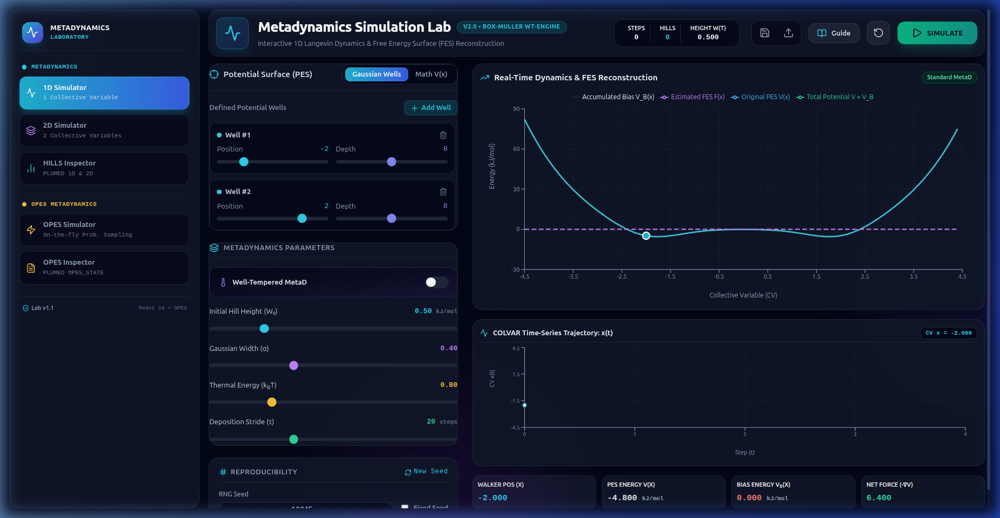
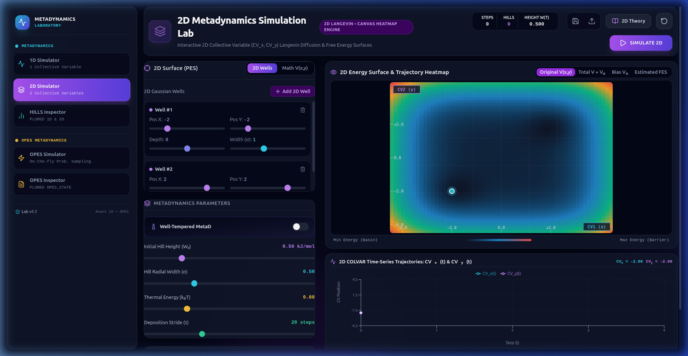
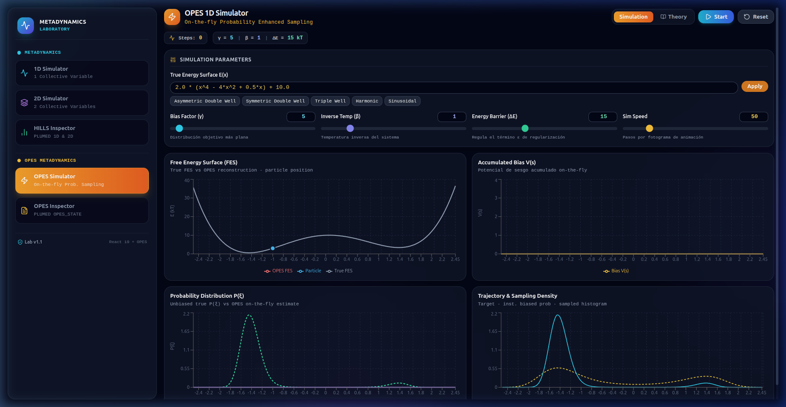
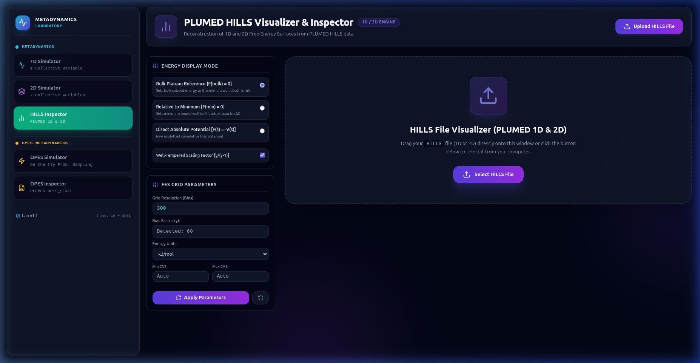
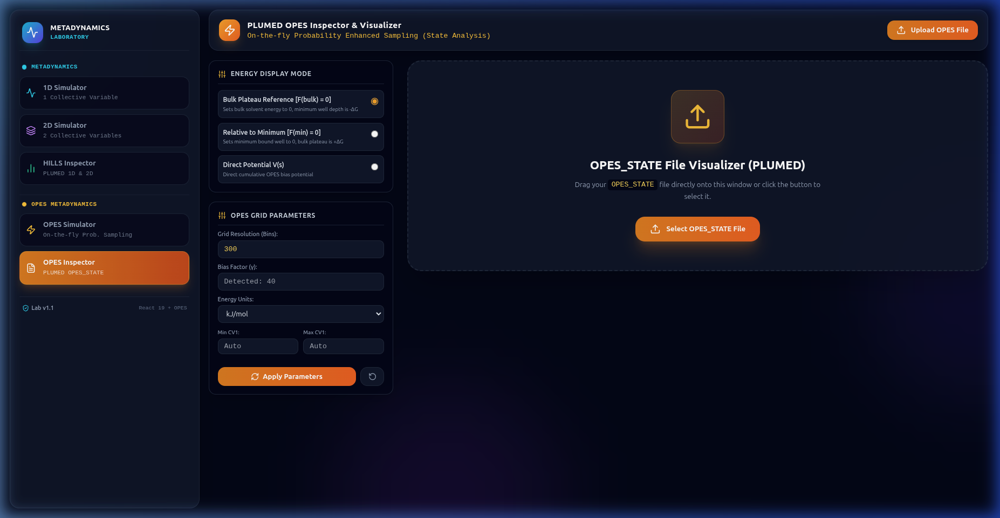

# Metadynamics & OPES Laboratory Web Application

[](https://react.dev/)
[](https://vitejs.dev/)
[](https://tailwindcss.com/)
[](https://opensource.org/licenses/MIT)

Interactive React web application for **1D & 2D Metadynamics**, **OPES (On-the-fly Probability Enhanced Sampling)**, and **PLUMED File Analysis (HILLS & KERNELS Inspector)**.

---

## 📸 Interface Screenshots

| 🧪 1D Metadynamics Simulator | 🌐 2D Metadynamics Heatmap |
| :---: | :---: |
|  |  |

| ⚡ OPES 1D Simulator | 📈 PLUMED HILLS Inspector |
| :---: | :---: |
|  |  |

| 🔍 PLUMED OPES Inspector |
| :---: |
|  |

---

## ⚡ Quick Start

### 1. Install Dependencies
```bash
npm install
```

### 2. Start Development Server
```bash
npm run dev
```
Open your browser at `http://localhost:5173`.

### 3. Build for Production
```bash
npm run build
```
The optimized bundle will be compiled into the `dist/` directory.

---

## 🚀 Key Modules

1. **🧪 1D Metadynamics Simulator (`1D`)**:
   - Langevin dynamics in 1D ($CV_x$) with Standard & Well-Tempered Metadynamics (WT-MetaD).
   - Interactive Gaussian wells editor, custom mathematical functions $V(x)$, PRNG seed lock, and session JSON save/restore.

2. **🌐 2D Metadynamics Simulator (`2D`)**:
   - 2D Langevin dynamics over collective variables $(CV_x, CV_y)$.
   - High-performance HTML5 Canvas heatmap renderer ($V$, $V+V_B$, $V_B$, $F_{\text{est}}$) with Inferno, Viridis, Spectral, Plasma, and Coolwarm colormaps.
   - Interactive particle clicking & trajectory path tracing.

3. **⚡ OPES 1D Simulator (`OPES`)**:
   - On-the-Fly Probability Enhanced Sampling simulation.
   - Live probability distribution $P(s)$, bias potential $V(s)$, and Free Energy $F(s)$ reconstruction.
   - Interactive parameters for barrier estimation, kernel pace, initial bandwidth, and target distributions.

4. **📈 PLUMED HILLS Visualizer & Inspector (`HILLS`)**:
   - Offloads file parsing and grid math to a background Web Worker.
   - 60 FPS real-time animated timeline of FES reconstruction $F(s, t)$.
   - Drag & drop loader, plateau zero & min zero reference modes, convergence overlay analysis, and `fes.dat` export.

5. **🔍 PLUMED OPES Inspector (`OPES_INSPECTOR`)**:
   - Parses PLUMED `KERNELS` / `OPES_STATE` files.
   - Analyzes kernel expansion, weights, centers, and width evolution.
   - Real-time playback timeline scrubbing and one-click `fes.dat` export.

---

## 🛠️ Project Scripts

- `npm run dev` - Launch local dev server with HMR.
- `npm run build` - Compile production bundle.
- `npm run lint` - Run ESLint.
- `npm run preview` - Preview production build locally.
